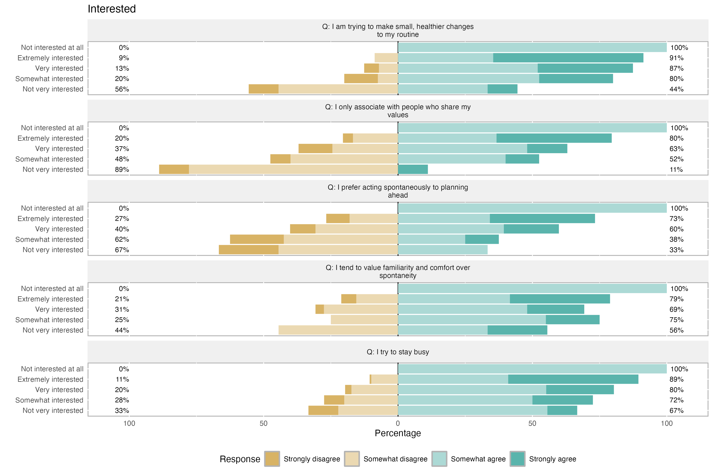

```{r setup, include=FALSE}
# Global R Chunk settings
knitr::opts_chunk$set(echo = FALSE,
                      warning = FALSE,
                      message = FALSE,
                      eval = TRUE,
                      echo = FALSE,
                      fig.align = "center") 


library(tidyverse) 
library(haven) # for factors
library(likert) # for plotting
library(psych)
library(ufs)
library(factoextra)
```

## Overview

`Kombucha` is a fermented tea beverage that has gained popularity in recent years due to its potential health benefits and unique flavor profile. It is made by fermenting sweetened tea with a symbiotic culture of bacteria and yeast (SCOBY), which results in a tangy, slightly effervescent drink.

Customers who are more likely to try kombucha typically exhibit certain characteristics or preferences that align with the product's attributes and perceived benefits:

1.  **Health-conscious Individuals**
2.  **Adventurous Consumers**
3.  **Environmentally Conscious Shoppers**
4.  **Younger Demographic**
5.  **Well-educated and Higher-income Individuals**

On the other hand, customers who are less likely to try kombucha may include:

1.  **Traditional or Conservative Consumers**
2.  **Skeptical or Risk-averse Individuals**
3.  **Taste-sensitive Individuals**

Overall, understanding the characteristics and preferences of different customer segments can help businesses target their marketing efforts and product positioning to appeal to the right audience for kombucha. By identifying and appealing to the demographics and psychographic profiles of customers who are more likely to try kombucha, companies can maximize their market penetration and sales potential.

## Introduction

As [brand] embarks on its next phase of growth, it is imperative to make informed decisions driven by data insights. To understand and target [brand]'s current and potential future audiences effectively, a comprehensive analysis of customer segments based on values and behaviors relevant to `kombucha consumption` is crucial.

Here is the result of the analysis of a set of survey data targeting a representative sample of 1,000 U.S. adults interested in health and trying new things.

### Objective

The primary objective of this analysis is to identify segments of potential customers based on their mindsets and attitudes, as reflected in the responses to `51 psychographic survey` questions. Statistical clustering techniques are used to identify customer segments that exhibit similarities in their preferences, values, and behaviors related to kombucha consumption.

-   group like-minded people together based on their mindsets and attitudes, not their demographic profile

-   which type of customers are more or less likely to try `kombucha` and why

### Data

```{r echo=FALSE}
data <- readRDS('data/assignment_data.rds')
# assignment_data%>%View
```

```{r echo=FALSE}
data[,c(1,16:20)]%>%
  mutate_all(haven::as_factor)%>%
  drop_na()%>%
  head()%>%
  knitr::kable()
```

### Survey Demographics

```{r echo=FALSE}
demographic_data <- data%>%
  select(starts_with("d_"))

demographic_data%>%
  rename_with(~gsub("d_|hh|hh_","",.))%>%
  names()
```

```{r echo=FALSE}
demographic_data <- select(data, starts_with("d_"))%>%
  rename_with(~gsub("d_|hh|hh_","",.))%>%
  mutate(id=row_number())%>%
  relocate(id)%>%
  select(-kom_aware)

demographic_data%>%
  drop_na()%>%
  select(-id)%>%
  gather(Attributes, value, 1:19)%>%
  ggplot(aes(x=value)) +
  geom_bar(fill = "lightblue2", color = "black") + 
  facet_wrap(~Attributes, scales = "free_x") +
  labs(x = "Value", y = "Frequency")+
  theme_minimal()
```

### Survey Psychographic

```{r echo=FALSE}
psychographic_data <- select(data, starts_with("seg_"))
```

```{r echo=FALSE, results='hide'}
# Questions  
q_seg <- labelled::var_label(data)%>%
  as_data_frame()%>%
  select(-response_id)%>%
  pivot_longer(cols = everything())%>%
  filter(str_detect(name,"seg_"))%>%
  separate(value,
           into=c("intro","Questions"),
           sep = "-")%>%
  select(-intro)%>%
  mutate(name=str_extract(name,"[a-z]_[0-9]"))%>%
  separate(name,
           into=c("section","number"),
           sep = "_")%>%
  mutate(Questions=gsub("[/.]","",Questions),
         Questions=trimws(Questions))
q_seg%>%select(Questions)%>%knitr::kable()
```

#### Extract psychographic variables for cluster frequencies

```{r echo=FALSE}
seg_freq <- psychographic_data%>%
  pivot_longer(cols = everything())%>%
  drop_na()%>%
  group_by(value) %>%
  summarise(frequency = n()) %>%
  mutate(percent = round(frequency/sum(frequency)*100, 1),
         value=haven::as_factor(value))
```

```{r echo=FALSE}
seg_freq %>%knitr::kable()
```

#### Overall agreement results

##### Pie Charts

```{r echo=FALSE}
seg_freq %>%
  ggplot(aes("", percent, fill = value)) + 
  geom_bar(stat="identity", width=1, color = "white") +
  geom_text(aes(y = cumsum(percent)-0.5*percent, 
                label = percent), 
            color = "white", size=3.5)+
  coord_polar("y", start=0) +
  scale_fill_viridis_d() +
  theme_void()
```

```{r echo=FALSE}
psy_q <- psychographic_data %>%
  pivot_longer(cols = everything())%>%
  drop_na()%>%
  mutate(name=str_extract(name,"[a-z]_[0-9]"),
         value=haven::as_factor(value))%>%
  separate(name,
           into=c("Qgroup","Qn"),
           sep = "_")%>%
  group_by(Qgroup,value) %>%
  summarise(frequency = n())%>%
  mutate(percent = round(frequency/sum(frequency)*100, 1),
         position = cumsum(percent)- 0.5*percent)
```

#### Agreement results based on type of question group (a, b, c, d, e, f)

```{r echo=FALSE}
psy_q%>%
  ggplot(aes("", percent, fill = value)) + 
  geom_bar(stat="identity", width=1, color = "white") +
  geom_text(aes(y = position, label = percent), 
            color = "white", size=2.5)+
  facet_wrap(~Qgroup) +
  scale_fill_viridis_d()+
  coord_polar("y", start=0) +
  theme_void()
```

#### Likert Plots

```{r echo=FALSE}
names(psychographic_data)<- paste("Q:",unlist(q_seg$Questions))
survey <- demographic_data%>%
  cbind(psychographic_data)%>%
  #rownames_to_column(var="id")%>%
  mutate_all(haven::as_factor)%>%
  drop_na()%>%
  as.data.frame()

# survey%>%names
```

General positive and negative responses to all questions.

```{r echo=FALSE, eval=FALSE}
plot(likert(survey[,22:72]), ordered = F, wrap= 60)
# ggsave("survey_res.png",height = 12,width = 10)
```

<center>{width="50%"}</center>

###### Kom tried

```{r echo=FALSE,eval=FALSE}
survey_p2 <- plot(likert(survey[,66:72], grouping = survey[,18]))+
  labs(title = "Kom tried ")

cowplot::save_plot("images/survey_p2.png", # where to save the plot
                   survey_p2,        # object to plot
                   base_asp = 1.5,  # ratio of space fro questions vs space for plot
                   base_height = 8)
```

<center></center>

```{r echo=FALSE, eval=FALSE}
survey_p3 <- plot(likert(survey[,66:72], grouping = survey[,19]))+
  labs(title = "Kom tried")
cowplot::save_plot("images/survey_p3.png", # where to save the plot
                   survey_p3,        # object to plot
                   base_asp = 1.5,  # ratio of space fro questions vs space for plot
                   base_height = 8)
```

<center></center>

###### Kom drink

```{r echo=FALSE, eval=FALSE}
survey_p4 <- plot(likert(survey[,66:72], 
                         grouping = survey[,20]))+
  labs(title = "Kom drink")
cowplot::save_plot("images/survey_p4.png", # where to save the plot
                   survey_p4,        # object to plot
                   base_asp = 1.5,  # ratio of space fro questions vs space for plot
                   base_height = 8)
```

<center></center>

###### Customer general tendency in buiyng new things

```{r echo=FALSE, eval=FALSE}
survey_p5 <- plot(likert(survey[,c(22,30,40,43,48)], 
            grouping = survey[,18]))+
  labs(title = "Interested") 

cowplot::save_plot("images/survey_p5.png", # where to save the plot
                   survey_p5,        # object to plot
                   base_asp = 1.5,  # ratio of space fro questions vs space for plot
                   base_height = 8)
```

<center></center>

### How strongly correlated are the responses

#### Metrics

The metrics used are the Cronbach’s $\alpha=\frac{N\bar{c}}{\bar{v}+(N-1)\bar{c}}$ Cronbach’s $\alpha$ measure internal consistency or reliability on how strongly the responses correlate. (If the values are low (below .7) this indicates that the questions are not internally consistent). Other are Guttman’s (G6) $\lambda$, and Omega $\omega$.

The data shows a very good $\alpha=0.94$ internal consistency.

```{r echo=FALSE}
psychographic_data <- select(data, !starts_with("d_"))

qs<-names(psychographic_data[,-1])
# psychographic_data[qs[1:4]]
```

```{r echo=FALSE}
Cronbach <- psych::alpha(psychographic_data[qs[1:51]],check.keys = T)
summary(Cronbach)
```

```{r echo=FALSE,eval=FALSE}
Cronbach$alpha.drop%>%
  filter(raw_alpha>0.9348443)
```

##### Reliability

```{r echo=FALSE}
# extract reliability measures
reliability <- ufs::scaleStructure(psychographic_data[qs[1:51]])
# inspect results
reliability
```

#### Factor analysis

```{r echo=FALSE}
# remove respondent
factoranalysis <- psychographic_data[,-1]%>%
  drop_na()%>%
  factanal(3, rotation="varimax")
```

```{r echo=FALSE}
load <- factoranalysis$loadings[,1:2]

load %>%
  as_data_frame()%>%
  cbind(q_seg) %>%
  ggplot(aes(x=Factor1,y=Factor2,
             group=section,
             label=Questions,color=section))+
  geom_text(size=2,check_overlap = T,
            key_glyph = draw_key_rect)+
  geom_abline()+
  scale_color_viridis_d()+
  theme_minimal()
```

#### Segmentation Analysis

Utilizing k-means clustering for partitioning data into distinct clusters, we can identified homogeneous groups of respondents based on similarities in their psychographic responses. The optimal number of clusters was determined through empirical methods such as the elbow method or silhouette method.

```{r}
# Standardize the psychographic variables
psychographic_data_standardized <- 
  readRDS('data/assignment_data.rds') %>%
  select(starts_with("seg_"))%>%
  mutate(id=row_number())%>%
  relocate(id)%>%
  drop_na()

psychographic_data_standardized_sd<- 
  psychographic_data_standardized%>%
  select(-id)%>%
  scale()
```

#### K-means

Determine the optimal number of clusters

##### Elbow method

```{r}
fviz_nbclust(psychographic_data_standardized_sd, # data  
             kmeans, # clustering algorithm 
             nstart = 25, 
             iter.max = 200, 
             method = "wss") # elbow method
```

There is no sharp elbow. For this reason, it draws attention as a result open to interpretation. An interpretation based on this elbow may therefore lead to incorrect results. It can be inferred that the optimal number of clusters is two.

##### Silhouette method

```{r}
fviz_nbclust(psychographic_data_standardized_sd, 
             kmeans, 
             method = "silhouette")+
  labs(subtitle = "Silhouette method")
```

##### Gap statistic

```{r}
#| eval: false
set.seed(123)
fviz_nbclust(psychographic_data_standardized_sd, 
             kmeans, 
             nstart = 25,  
             method = "gap_stat", 
             nboot = 50)+
  labs(subtitle = "Gap statistic method")
```

#### K-means calculation

Start considering K=2, two clusters.

```{r}
k <- 2

# Apply k-means clustering
set.seed(123) # for reproducibility
kmeans_result <- kmeans(psychographic_data_standardized_sd, 
                        centers = k,
                        iter.max=100,
                        nstart=50,
                        algorithm="Lloyd")
```

Extract cluster assignments

```{r}
clusters <- kmeans_result$cluster
```

### Cluster Visualization

We visualized the clustering results using a scatter plot, allowing for a clear understanding of how respondents are grouped into distinct segments based on their psychographic profiles.

Examine cluster characteristics

```{r}
cluster_centers <- kmeans_result$centers
cluster_centers_df <- as.data.frame(cluster_centers)

cluster_centers_df%>%
  rownames_to_column(var="clusters")%>%
  pivot_longer(cols = -clusters)%>%
  ggplot(aes(x=value,fill=clusters))+
  geom_histogram(position = "identity",alpha=0.7)+
  coord_polar()+
  theme_minimal()
```

### Demographic Analysis

We analyzed demographic differences between the identified clusters to understand how customer segments differ in terms of demographic characteristics such as age, gender, income, and geographic location.

```{r}
clustered_data <- bind_cols(clusters=clusters,
                            psychographic_data_standardized)%>%
  inner_join(demographic_data,by="id")%>%
  pivot_longer(cols = starts_with("seg_"))
# clustered_data
```

```{r}
clustered_data%>%
   mutate_all(haven::as_factor)%>%
  pivot_longer(cols = urban:kom_drink,
               names_to = "demo_name",
               values_to = "demo")%>%
  ggplot(aes(x=demo,fill=clusters,color=clusters))+
  geom_bar(position = "dodge",alpha=0.7,show.legend = F)+
  facet_wrap(~demo_name,scales = "free")
```

### Principal Component Analysis (PCA)

Let's now increase the number of k-means clusters to 6, and calculate the PCA components.

```{r}
dat<- psychographic_data_standardized[,c(2:52)]%>%
  drop_na()%>%
  scale()

k6_demo<-kmeans(dat,
           6,
           iter.max=100,
           nstart=50,
           algorithm="Lloyd")
```

```{r}
pcclust=prcomp(psychographic_data_standardized[,c(2:52)],
               scale=FALSE,cor=TRUE) 

# summary(pcclust)
# pcclust$rotation[,1:2]
```

The max number of components that summarize the highest level of variability in the data is 2.

```{r}
plot(pcclust,type="lines")
```


Finally, here is a visualization of the two components across the 6 clusters, we can see that the highest level of variability corresponds to clusters 3 and 4. Things changes if we focus only on two clusters.

```{r}
digCluster<-k6_demo$cluster; 
dignm<-as.character(digCluster); # K-means clusters
```

```{r}
dat2 <- cbind(pcclust$x[,1:2],
      psychographic_data_standardized[,c(2:52)]%>%
        rownames_to_column("id")%>%
        mutate(id=as.integer(id))%>%
        inner_join(demographic_data,by="id"))%>%
  as_data_frame()%>%
  select(PC1,PC2)%>%
  cbind(digCluster=digCluster)

dat2%>%
  ggplot(aes(PC1,PC2,color =factor(digCluster)))+
  geom_point()+
  scale_color_viridis_d()+
  labs(x ="PC1",y="PC2",
       color="clusters")+
  theme_minimal()
```


### A quick look at the Kom Demographics


```{r}
groups <- data%>%
  select(!contains("seg"),-response_id)%>%
  select(15:19)%>%
  mutate_all(haven::as_factor)
```

```{r}
seg <- data %>%
  select(contains("seg"),-response_id)
seg[is.na(seg)] <- 0
PrincipalComponents <- princomp(seg,cor=TRUE)
```


```{r}
PrincipalComponents$scores%>%
  as.data.frame()%>%
  select(1:2)%>%
  cbind(groups) %>%
  pivot_longer(cols = 3:7)%>%
  ggplot(aes(x=Comp.1,y=Comp.2,group=value))+
  geom_point(aes(color=value),
             size=0.5,
             alpha=0.5,
             show.legend = F)+
  facet_wrap(~name)+
  theme_minimal()
```


### Futher analysis

```{r}
# kmeans_result
digCluster_2<-kmeans_result$cluster; 
dignm<-as.character(digCluster_2);


```

```{r}
dat2 <- cbind(pcclust$x[,1:2],
      psychographic_data_standardized[,c(2:52)]%>%
        rownames_to_column("id")%>%
        mutate(id=as.integer(id))%>%
        inner_join(demographic_data,by="id"))%>%
  as_data_frame()%>%
  select(PC1,PC2)%>%
  cbind(digCluster=digCluster_2)

dat2%>%
  ggplot(aes(PC1,PC2,color =factor(digCluster_2)))+
  geom_point()+
  scale_color_viridis_d()+
  labs(x ="PC1",y="PC2",
       color="clusters")+
  theme_minimal()
```